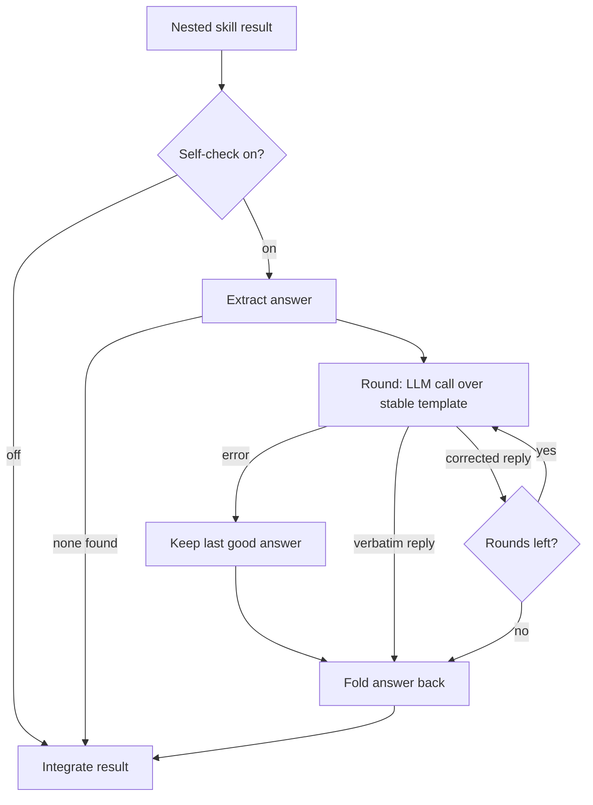

# Agents

This chapter describes the agent configuration model in ARES v0.10.0.
Every field here is read from the source files named in each section.

Agent behavior comes from TOML configuration. The root file `ares.toml` carries an `[agents]` table. You can also keep agents in TOON files under `config/agents/`. The `config.agents_dir` key in `ares.toml` sets that directory (`crates/ares-http/src/overlay.rs`, `DynamicConfigPaths`).

## Agent fields

Each agent entry deserializes into `AgentConfig` (`crates/ares-agent/src/config.rs`):

| Field | Type | Default | Meaning |
|---|---|---|---|
| `model` | string | required | Model name defined under `[models]`. Missing values fail deserialization. |
| `system_prompt` | string | none | Personality and instructions for the agent, per the source doc comment. |
| `tools` | list of strings | empty | Tool names this agent uses. |
| `allowed_tools` | list of strings | all tools | Whitelist of permitted tool names. Absent means all tools are allowed. |
| `max_tool_iterations` | integer | 10 | Maximum tool-calling rounds before the agent stops. |
| `parallel_tools` | boolean | false | Run independent tool calls in parallel when possible. |
| `compaction_enabled` | boolean | false | Turn on per-session history compaction through the LLM `Compactor`. Long conversations stay a bounded working set instead of a last-5 history slice. |
| *(extra keys)* | table | empty | Unknown keys pass through unchanged via `#[serde(flatten)]`. |

Deserialization details worth knowing when you write TOML:

- Only `model` lacks a serde default. Every other field tolerates absence.
- `allowed_tools` carries `skip_serializing_if = "Option::is_none"`. An absent key stays absent on round-trip, so "all tools" survives config rewrites.
- `compaction_enabled` is an `Option<bool>`. The engine reads `unwrap_or(false)`, so omitting the key equals `false`.
- Extra keys land in `extra: HashMap<String, toml::Value>` (`#[serde(flatten)]`). They never fail parsing. Runtime consumers read them by name.

## Agent resolution order

The resolver (`crates/ares-agent/src/resolver.rs`) picks one agent definition from three tiers:

1. Tenant database row (`tenant_db tenant_agents`).
2. Community public agent.
3. System agent from static TOML/TOON configuration.

The first tier that holds the name wins. The scope comes from the request isolate label, then a tenant context intercept, then a fallback id.

## Skills configuration

The `[skills]` group deserializes into `SkillsTomlConfig` (`crates/ares-agent/src/workflows_config.rs`):

- `project_dir` — project skills directory, for example `./.claude/skills/`.
- `personal_dir` — personal skills directory, for example `~/.claude/skills/`.
- `plugin_dirs` — extra directories to scan for `SKILL.md` files.

All three keys are optional.

## Workflows

A workflow defines how agents work together. Each entry under `[workflows.<name>]` deserializes into `WorkflowConfig` (`crates/ares-agent/src/workflows_config.rs`):

| Field | Type | Default | Meaning |
|---|---|---|---|
| `entry_agent` | string | required | Agent that receives the initial request. |
| `fallback_agent` | string | none | Agent used when routing fails or no match exists. |
| `max_depth` | integer | 3 | Maximum depth for nested workflows. |
| `max_iterations` | integer | 5 | Maximum iterations for iterative workflows. |
| `parallel_subagents` | boolean | false | Execute sub-agent calls in parallel. |

The engine (`crates/ares-agent/src/workflows/engine.rs`) runs steps through the unified executor and records a `WorkflowStep` per hop: `agent_name`, `input`, `output`, `timestamp`, `duration_ms`. The result is a `WorkflowOutput` with `final_response`, `steps_executed`, `agents_used`, and `reasoning_path`. Workflows live on the context as a `WorkflowSet`; the HTTP overlay copies `[workflows]` from TOML into it.

## Delegation flags

Skill delegation arguments parse into `DelegationArgs` (`crates/ares-agent/src/skills/mod.rs`). Parsing runs in two steps: tokenizing, then flag assignment.

### Tokenizer rules

`tokenize_delegation_args` scans characters once:

1. Whitespace outside quotes splits tokens. Empty tokens never appear.
2. A double-quoted segment forms one token. It may contain spaces and bare `|`.
3. Inside quotes only, a backslash escapes the next character. Outside quotes a backslash is an ordinary character.
4. Quotes themselves disappear from the output token. `"delta echo"` becomes `delta echo`.

### Flag assignment

`parse_delegation_args` walks the token list left to right:

- `--parallel` latches split-per-token mode. After the flag, every plain token starts its own task and `|` separators are ignored. Tokens before the flag stay one sequential task.
- `--model <value>` consumes exactly one following token as the model override. A missing value returns the error `--model consumes exactly one value; none given`.
- `--tools` enables the inner tool loop for delegated tasks. It takes no value.
- Before the latch, bare `|` separates sequential tasks. After the latch, bare `|` is dropped.

### Parallel task cap

`MAX_PARALLEL_DELEGATED_TASKS` equals `MAX_SKILL_CALL_DEPTH`, which is 8 (`crates/ares-agent/src/skills/mod.rs`). Each parallel task becomes its own delegated skill call one level deeper, so the recursion depth is the natural ceiling. Excess tasks are truncated, not rejected.

### Model resolution precedence

`DelegationArgs::resolved_model(profile_default, global_default)` applies this order:

1. Explicit `--model` flag.
2. Profile default model, when non-empty.
3. Global default model.

An empty profile default falls through to the global default.

### Worked examples

Both examples come verbatim from the test suite (`delegation_flag_tests`, same file).

Example 1 — quoted pipe inside one sequential task:

```text
translate "hello | world" --model fast-model --tools
```

Result: one task with tokens `["translate", "hello | world"]`, `model = "fast-model"`, `tools = true`, `parallel = false`. The quoted pipe does not split the task because quoting happens at tokenize time, before any `|` handling.

Example 2 — latch mid-stream:

```text
alpha | beta --parallel gamma "delta echo" | epsilon
```

Result: five tasks — `alpha`, `beta`, `gamma`, `delta echo`, `epsilon`. `alpha` and `beta` split on the first pipe. After `--parallel` latches, `gamma` starts a task, the quoted `"delta echo"` forms its own task despite the space, and the trailing `|` is ignored.

## Review gate for delegated results

`SkillsPluginConfig.review_delegated_results` (`crates/ares-agent/src/skills/mod.rs`) opts nested skill results into a review micro-step before integration:

- Off by default. A missing or failing reviewer passes the original result through.
- On acceptance, the original result integrates unchanged.
- On rejection, the parent receives a structured rejection with review notes; the original stays intact in metadata for re-dispatch.

### Verdict protocol

The reviewer prompt uses a fixed preamble (`DELEGATED_REVIEW_TEMPLATE`, same file). The preamble asks the reviewer to judge consistency between result and requested input. It requires the verdict word on the first line, followed by one sentence of notes. The preamble is byte-stable across calls so provider-side prompt caches hit on it.

`parse_review_verdict` applies these rules:

1. Take the first non-empty line of the reply.
2. Skip leading non-alphabetic characters, then read the first alphabetic run as the verdict word.
3. Accept exactly `ACCEPT` or `REJECT`. Anything else is a parse error.
4. Notes are the rest of the first line plus any further lines.

An empty reply or an unparsable verdict returns an error. Callers treat that error like a reviewer outage: the original result integrates unchanged. The gate never guesses.

### Rejection payload shape

On rejection the parent receives this JSON structure instead of the original result:

```json
{
  "status": "rejected",
  "review": { "accepted": false, "notes": "<reviewer text>" },
  "metadata": {
    "delegated_skill_id": "<nested skill id>",
    "original_result": { "...": "unchanged original" }
  }
}
```

The gate snapshots the delegated input before running the sub-execution. With the gate off, no snapshot allocation happens.

Without the `postgres` feature there is no reviewer, so the gate is permanently off and every result passes through.

## Self-check rounds

`SkillEngine::with_self_check_rounds(n)` (`crates/ares-agent/src/skills/engine.rs`) adds critique rounds over each nested skill result before integration. One LLM call runs per round. Off by default; zero behaves identically to off.

### Round flow

Each round follows this sequence:

1. Extract the answer text. Structured results contribute their `content` field; bare strings contribute themselves. Results with neither carry nothing checkable, so the loop skips them.
2. Build the prompt from a byte-stable template (`SELF_CHECK_TEMPLATE`, same file). The template asks two questions: did the answer address the requested task, and are there obvious errors or omissions. The tail names the delegated skill id, the requested input, and the current answer.
3. Send one LLM call.
4. On success, compare the reply with the current answer. A verbatim reply means no corrections were found, so the loop exits early.
5. On error, stop the loop. The last good answer stays in place. No retry happens inside the loop.
6. After the rounds end, fold the answer back. Structured results keep their shape; only `content` moves. Bare strings are replaced whole. An unchanged answer leaves the result untouched.



The template prefix stays identical across rounds, so provider-side prompt caches hit on every round after the first.

Delegated sub-workflows accept only allowlisted step kinds. Nested tool rounds hard-cap at three (`check_tool_round_cap`). Anti-recursion blocks delegation inside a delegated sub-workflow (`validate_delegated_step`). Slash-command chatter lines are stripped from delegated text before it enters the parent context (`sanitize_result_value`).

## Ambient enrichment

`AmbientEnrichmentConfig.enabled` (`crates/ares-agent/src/skills/engine.rs`) is off by default. When enabled, each LLM step completion fires two parallel micro calls after the answer: intent classification and keyword tagging. Outcomes attach as session metadata on the skill-step record under the `ambient_enrichment` key. Enrichment input truncates at 4000 characters. Failures log at debug level and never delay or fail the completion.

## Emergency stop

`EmergencyStop` (`crates/ares-agent/src/emergency_stop.rs`) is a Cordis service holding one atomic boolean. `set_active(true)` turns the kill switch on; `set_active(false)` clears it. Startup provides a fresh instance set to inactive when none exists yet (`crates/ares-agent/src/plugins.rs`).

### Propagation path

The switch reaches execution through the shared context:

1. Plugins provide `EmergencyStop` on the root context.
2. Skill execution resolves it with `ctx.get::<EmergencyStop>()`.
3. `ensure_execution_active` (`crates/ares-agent/src/skills/engine.rs`) checks the flag before every nested skill call. The check runs at call boundaries, so a stop request lands at the next boundary without cancelling in-flight work mid-call.
4. An active flag aborts with the stable marker `subtask_cancelled` prefixed to the error text, so callers classify aborts without parsing prose.
5. The aborted subtask integrates nothing into the parent context.

Per-subtask cancel tokens work alongside the global switch. Tokens are sticky cancel flags keyed `"{run_id}/{skill_id}"`; registration is idempotent and there is no un-cancel. Execution reads the registry fresh at every boundary, so an external trigger racing a starting subtask still stops it at its first call boundary. Token aborts reuse the same `subtask_cancelled` marker.

## Worked example

Every key below appears in the structures cited above. The file passes `ares-server config --validate` on the v0.10 tree:

```toml
[server]
host = "127.0.0.1"
port = 3000
log_level = "info"

# Required tables; every field inside defaults, so empty tables work.
[auth]
jwt_secret_env = "JWT_SECRET"
api_key_env = "API_KEY"

[database]

[providers.local]
type = "ollama"
base_url = "http://localhost:11434"
default_model = "llama3.1:8b"

[models.default]
provider = "local"
model = "llama3.1:8b"
temperature = 0.7
max_tokens = 512

[agents.helper]
model = "default"
system_prompt = "You answer questions about internal documents."
tools = ["calculator"]
allowed_tools = ["calculator"]
max_tool_iterations = 10
parallel_tools = false
compaction_enabled = true

[workflows.support]
entry_agent = "helper"
fallback_agent = "helper"
max_depth = 3
max_iterations = 5
parallel_subagents = false

[skills]
project_dir = "./.claude/skills/"
```

Validation output, captured from a real run (`exercised`):

```console
$ ares-server config --validate
  ✓ Configuration is valid!

  Configuration Summary

    Config file: ares.toml
    Server: 127.0.0.1:3000
    Log level: info

  Providers
    • local

  Models
    • default

  Agents
    • helper
```

Omitting either `[auth]` or `[database]` fails with `missing field 'auth'` or `missing field 'database'`. The tables themselves are required even though every field inside them carries serde defaults.
