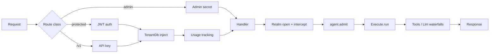
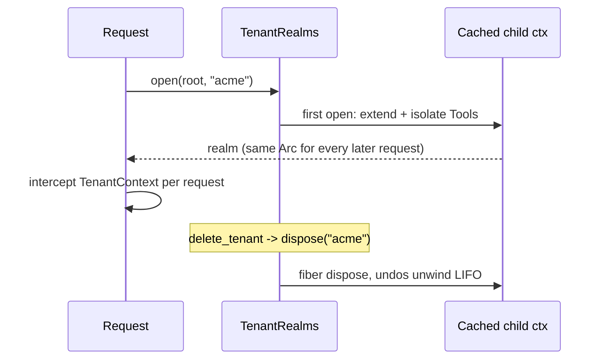

# Architecture

ARES is a Cargo workspace. One root package, `ares-server`, holds the binary and the library facade. Ten crates under `crates/` hold the capabilities. The kernel crate is published as `ares-cordis`; the workspace imports it as `cordis`.

## Crate map

| Crate | Role | Depends on |
|-------|------|------------|
| `ares-server` | Binary and library facade. Boots the server, registers factories, binds HTTP. | all capability crates, `cordis` |
| `cordis` (`ares-cordis`) | Kernel. Typed `Context`, plugins, loader, fibers, events, intercepts. | none |
| `ares-types` | Shared types and errors (`AppError`, `TenantContext`). | `cordis` |
| `ares-vector` | Embedded vector store with HNSW. Standalone; no workspace dependencies. | none |
| `ares-rag` | Retrieval-augmented generation pipeline and embeddings. | `ares-types`, `ares-llm`, `cordis` |
| `ares-store` | Persistence. PostgreSQL through sqlx, Turso/libSQL behind a feature. Embeds migrations. | `ares-types`, `cordis`; optional `sqlx`, `libsql`, `ares-vector` |
| `ares-tools` | Tool trait, static and runtime tool registry, calculator. | `ares-types`, `cordis`; optional `ares-store`, `ares-mcp` |
| `ares-llm` | Provider clients, factory, pool, circuit breaker, `Llm` service. | `ares-types`, `ares-tools`, `cordis`; optional `ares-store` |
| `ares-mcp` | Model Context Protocol glue: client, auth, registry, server. | `ares-types`, `cordis`; optional `ares-store` |
| `ares-agent` | Agents: registry, router, orchestrator, `Execute` service, tenant scoping. | `ares-types`, `ares-llm`, `ares-tools`, `cordis`; optional `ares-store` |
| `ares-http` | Axum routes, middleware, auth, overlay config, admin handlers. | `ares-agent`, `ares-tools`, `ares-llm`, `ares-store`, `ares-rag`, `ares-types`, `cordis`; optional `ares-mcp`, `ares-vector` |

The same crates with one-line data-flow notes each:

| Crate | Data that flows through it |
|---|---|
| `ares-server` | Boot order and wiring only: it pushes factories into the context and hands the context to the HTTP listener; no domain data crosses it at request time. |
| `cordis` | Service handles and dependency epochs. Every `get::<T>()` in the server resolves here; versions bump when a store entry changes. |
| `ares-types` | Structs every crate shares: requests, responses, errors, `TenantContext`. Pure data; no I/O. |
| `ares-vector` | Raw f32 vectors plus HNSW graph nodes in process memory; queries enter as vectors and leave as neighbor ids and distances. |
| `ares-rag` | Text in, embeddings out: chunks go to an embedder, vectors to a store, and query results back through scoring and reranking. |
| `ares-store` | Rows over sqlx: tenants, API keys, usage, agent versions, runs. Migrations flow outward from the embedded migrator at boot. |
| `ares-tools` | JSON tool calls in, JSON results out. The registry maps names to `Tool` impls; per-tenant allowlists gate resolution. |
| `ares-llm` | Chat completions to provider HTTP APIs; token counts and latency back. The circuit breaker wraps each provider client. |
| `ares-mcp` | MCP protocol frames both ways: external servers become agent tools; the built-in MCP server exposes ARES agents outward. |
| `ares-agent` | The run pipeline: admitted request, tool-call rounds against `Tools`/`Llm`, assembled final response, run records toward storage. |
| `ares-http` | HTTP in, responses out. Middleware attaches tenant identity and usage; handlers open realms and call `Execute`. |

Feature flags forward down the chain. `postgres` enables sqlx in store, agent, mcp, tools, and http. HTTP LLM providers compile in through the default `genai` feature of `ares-llm`. `llamacpp` remains optional.

## Process lifecycle

Startup follows one ordered pass in `run_server` (`src/main.rs:524`). Each step gates the next:

1. Load `.env` and start tracing (`src/main.rs:528-532`).
2. Create the root Cordis `Context` and the `ReflectService` (`src/main.rs:534-554`). The service registers notifiers for the `Tools` and `Llm` types and fires an initial `notify`, so dependents reconcile from the first moment.
3. Register loader factories through `register_loader_factories` (`src/main.rs:328`, called at `src/main.rs:557-558`). Explicit chains run without the `inventory` feature; inventory collection runs with it.
4. Boot the entries program (`src/main.rs:560-568`): parse `config/cordis-entries.toml`, compose includes, instantiate entries in file order. The `Overlay` entry runs early and fills empty entry configs from `ares.toml`. A boot failure logs `Cordis Loader: boot failed` and exits with code 1.
5. Guard configuration presence (`src/main.rs:570-585`). A missing config prints an `ares-server init` hint and exits with code 1.
6. Start the entries watcher (`src/main.rs:592-625`). File events re-compose the program and apply diffs through the loader journal. When the watcher cannot start, a 30-second modified-time poll replaces it.
7. Preload runtime providers (`src/main.rs:630-632`) and snapshot current agent definitions into the version history (`src/main.rs:673-707`).
8. Build CORS and rate-limit layers (`src/main.rs:895-944`), bind the TCP listener (`src/main.rs:949-950`), and serve the Axum router with graceful shutdown on Ctrl+C and SIGTERM (`src/main.rs:957-964`).

Step 8 is the first step that touches the network for serving. A failure in any earlier step exits before any port opens.

### The rate-limit layer

When `rate_limit_per_second > 0`, startup wraps the router in `tower_governor` (`src/main.rs:900-913`). The limiter is a GCRA bucket per client IP. It admits up to `rate_limit_burst` requests immediately and then admits one more request every \\(1/\text{rate\_limit\_per\_second}\\) seconds. A background task prunes idle per-IP buckets every 60 seconds (`src/main.rs:917-930`). Responses carry `x-ratelimit-*` headers. Setting `rate_limit_per_second = 0` removes the layer entirely and logs a warning.

## Request path

```
request / job
  -> TenantRealms.open then intercept (HTTP/MCP/JWT) or isolate only (background)
  -> agent.admit (Execute, JWT chat, API-key middleware, MCP)
  -> Execute::run
  -> Tools / Llm / skills via EventsService waterfalls
  -> response
```



Middleware order in `create_router` (`crates/ares-http/src/api/routes.rs`) matches this flow. On protected routes the outermost layer validates the JWT, the next layer injects `TenantDb` into extensions, and the innermost layer records token usage after the handler returns. Admin routes sit behind `admin_middleware`, which checks the `X-Admin-Secret` header. The `/v1` routes use API key authentication, plus context injection when the `eruka-context` feature is enabled.

Inside a handler, `request_tenant_ctx` opens the tenant realm and then applies the `TenantContext` intercept. Realms are cached child contexts; the same tenant gets the same realm. Background jobs call `tenant_scope` instead. They isolate without an intercept. The `agent.admit` event is the shared quota gate. A deny maps to HTTP 429 or an MCP tool error. After the gate, `Execute::run` drives tools, model calls, and skills through `EventsService` waterfalls.

## Cordis concepts as server concerns

- **Realms equal isolates.** `TenantRealms` keeps one child context per tenant id, each backed by one fiber. Data-bearing services such as `Tools` resolve inside the realm. Tenant delete calls `dispose`, which undoes that realm's provides in last-in-first-out order.
- **Providers equal LLM clients.** The `Llm` service wraps the provider registry. Its circuit breaker feeds `Service::check`. When the breaker opens, dependent fibers deactivate through guarded withdrawal.
- **Fibers own lifecycle.** Each provided service has a fiber. `Fiber::refresh` recomputes the dependency epoch. Losing a dependency moves a fiber to Pending, not Failed. Hot swap replaces a service in place; retire withdraws it under guard while consumers exist.

### Peer-dependency versions

Provider versions are plain `u64` values with a packed layout (`crates/cordis/src/context.rs:227-247`, constant `VERSION_MAJOR_SCALE = 100_000`). The major lives in the high digits and the minimum compatible floor in the remainder:

$$\text{major}(v) = \left\lfloor \frac{v}{100\,000} \right\rfloor, \qquad \text{floor}(v) = v \bmod 100\,000$$

An inject that requires \\(M \cdot 100\,000 + f\\) is satisfied by provider version \\(p\\) exactly when the provider exists and is available, \\(\text{major}(p) = M\\), and \\(p \geq M \cdot 100\,000 + f\\). Any mismatch leaves the inject unsatisfied and the dependent fiber `Inactive`; it never binds across a major boundary. Legacy `provide()` installs version 0, which satisfies only unconstrained injects.

## Storage model

PostgreSQL is the default backend, through sqlx with rustls TLS. Turso/libSQL compiles behind the `turso` feature for edge deployment. Vector data lives in `ares-vector` by default, or in Qdrant, pgvector, ChromaDB, Pinecone, or LanceDB behind features. SQL migrations are embedded in the `ares-store` crate at compile time. The migrator ships inside the published package, so `cargo install ares-server` needs no external files.

## Tenant realms

`TenantRealms` (`crates/ares-store/src/realms.rs`) is the cache that turns one row per tenant into one live child context per tenant.

- **Open once, reuse forever.** `open(root, tenant_id)` returns the cached child, or creates it on first call with a double-checked write (`realms.rs:35-47`). The child is `root.extend().isolate_type(tools_tid, tenant_id)`.
- **Only data-bearing services isolate.** The realm isolates on the `Tools` TypeId, so each tenant sees its own tool state and allowlists. `Execute` stays shared on purpose: it is a stateless engine, and its tenancy comes from the context handed to it (`realms.rs:29-34`). No `TenantContext` intercept lands inside the cached realm; handlers add it per request.
- **Disposal unwinds LIFO.** `dispose(tenant_id)` removes the child from the map and disposes its fiber (`realms.rs:49-57`). Fiber disposal undoes that realm's provides in last-in-first-out order, so teardown runs in exact reverse registration order. Tenant delete (`crates/ares-http/src/api/handlers/admin/tenants.rs`) calls this before dropping rows.



## Failure philosophy

ARES fails closed at every trust boundary:

- Missing or invalid JWT, API key, or admin secret rejects the request before any handler runs.
- Quota denial through `agent.admit` blocks execution.
- An availability predicate rejection marks a service Failed. Failed is terminal.
- Guarded withdrawal deactivates dependents instead of binding to an incompatible provider.
- Missing tenant database access during tenant resolution fails closed.
- Loader composition stays fail-open for bad includes so one broken file cannot brick a running reload, but a failed boot pass still exits with code 1.
- The emergency stop switch halts all agent execution.

## Retrieval scoring

Embedding similarity uses cosine similarity over dense vectors (`crates/ares-rag/src/embeddings.rs:128-149`):

$$\cos(a, b) = \frac{a \cdot b}{\lVert a \rVert\,\lVert b \rVert}$$

The implementation clamps the result to \\([-1, 1]\\) and returns \\(0\\) for mismatched lengths or zero magnitude instead of dividing by zero. Search results report distance, not similarity; `distance_to_similarity` maps cosine distance back with \\(1 - d\\), L2 with \\(1/(1+d)\\), and inner product with \\(-d\\) (`crates/ares-rag/src/search.rs:296-302`). The hybrid reranker then min-max normalizes retrieval scores across the candidate set and blends: \\(\text{final} = (1 - w)\,\text{norm}_{\text{retrieval}} + w\,\text{rerank}\\) (`crates/ares-rag/src/reranker.rs:362-371`).

## Design rules

Three rules explain most ARES behavior at failure boundaries. Each rule names one concrete place you can observe it.

### Fail closed

When identity or availability cannot be proven, reject; never guess. JWT scope resolution is the sharpest example: if claims name a tenant but no matching `TenantContext` exists, or the tenant store is absent, the request fails instead of falling back to an unscoped context (`crates/ares-http/src/auth/middleware.rs:31-32`). The same rule puts auth middleware outside every handler and makes quota denial through `agent.admit` block execution.

### Guarded withdrawal

A provider with live consumers does not vanish underneath them. Retiring a service through `POST /admin/cordis/services/{name}/retire` answers `409 {"retired": false, "reason": "guarded", "consumers": N}` while N active consumer fibers still rely on it; the removal happens only after the last consumer drops its reliance (`crates/ares-http/src/api/handlers/admin/cordis.rs:71-80`). Dependent fibers deactivate rather than bind to an incompatible replacement.

### Eager reconciliation

State changes propagate immediately, not at next use. Two mechanisms carry this rule:

- Boot wires `ReflectService` notifiers for `Tools` and `Llm` and fires an initial notify, so dependent fibers recompute their dependency epoch right away (`src/main.rs:534-554`).
- Editing `config/cordis-entries.toml` triggers parse, compose, diff-apply, and classify in one pass (`cordis::reload_entries_from_disk`, called from `src/main.rs:488-493`); consumers see the new provider set without a restart.

Together the three rules produce the observed lifecycle semantics: Pending means waiting, Failed means rejected permanently, and a guarded retire never leaves a consumer resolving nothing.
