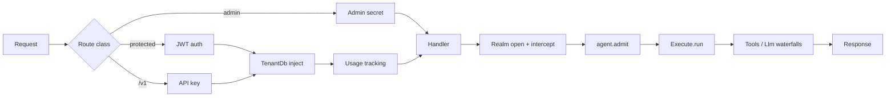

# Architecture

ARES is a Cargo workspace. One root package, `ares-server`, holds the binary and the library facade. Ten crates under `crates/` hold the capabilities. The kernel crate is published as `ares-cordis`; the workspace imports it as `cordis`.

## Crate map

| Crate | Role | Depends on |
|-------|------|------------|
| `ares-server` | Binary and library facade. Boots the server, registers factories, binds HTTP. | all capability crates, `cordis` |
| `cordis` (`ares-cordis`) | Kernel. Typed `Context`, plugins, loader, fibers, events, intercepts. | none |
| `ares-types` | Shared types and errors (`AppError`, `TenantContext`). | `cordis` |
| `ares-vector` | Embedded vector store with HNSW. Standalone; no workspace dependencies. | none |
| `ares-rag` | Retrieval-augmented generation pipeline and embeddings. | `ares-types`, `cordis` |
| `ares-store` | Persistence. PostgreSQL through sqlx, Turso/libSQL behind a feature. Embeds migrations. | `ares-types`, `cordis`; optional `sqlx`, `libsql`, `ares-vector` |
| `ares-tools` | Tool trait, static and runtime tool registry, calculator. | `ares-types`, `cordis`; optional `ares-store`, `ares-mcp` |
| `ares-llm` | Provider clients, factory, pool, circuit breaker, `Llm` service. | `ares-types`, `ares-tools`, `cordis`; optional `ares-store` |
| `ares-mcp` | Model Context Protocol glue: client, auth, registry, server. | `ares-types`, `cordis`; optional `ares-store` |
| `ares-agent` | Agents: registry, router, orchestrator, `Execute` service, tenant scoping. | `ares-types`, `ares-llm`, `ares-tools`, `cordis`; optional `ares-store` |
| `ares-http` | Axum routes, middleware, auth, overlay config, admin handlers. | `ares-agent`, `ares-tools`, `ares-llm`, `ares-store`, `ares-rag`, `ares-types`, `cordis`; optional `ares-mcp`, `ares-vector` |

Feature flags forward down the chain: `postgres` enables sqlx in store, agent, mcp, tools, http; `openai`, `azure`, and `bedrock` add providers in `ares-llm`.

## Process lifecycle

Startup follows one ordered pass in `run_server` (`src/main.rs`):

1. Load environment and start tracing.
2. Create the root Cordis `Context` and the `ReflectService`.
3. Register loader factories (`register_plugins` chains, or inventory collection).
4. Boot the entries program: parse `config/cordis-entries.toml`, compose includes, instantiate entries in file order. The `Overlay` entry runs early and fills empty entry configs from `ares.toml`. A boot failure exits with code 1.
5. Start the file watcher for the entries program. Reloads re-compose and apply diffs through the loader journal.
6. Bind the TCP listener and serve the Axum router with graceful shutdown.

The `Store` factory connects to the database, runs migrations from `ares_store::MIGRATOR`, and seeds default agent templates.

## Request path

```
request / job
  -> TenantRealms.open then intercept (HTTP/MCP/JWT) or isolate only (background)
  -> agent.admit (Execute, JWT chat, API-key middleware, MCP)
  -> Execute::run
  -> Tools / Llm / skills via EventsService waterfalls
  -> response
```



Middleware order in `create_router` (`crates/ares-http/src/api/routes.rs`) matches this flow. On protected routes the outermost layer validates the JWT, the next layer injects `TenantDb` into extensions, and the innermost layer records token usage after the handler returns. Admin routes sit behind `admin_middleware`, which checks the `X-Admin-Secret` header. The `/v1` routes use API key authentication, plus context injection when the `eruka-context` feature is enabled.

Inside a handler, `request_tenant_ctx` opens the tenant realm and then applies the `TenantContext` intercept. Realms are cached child contexts; the same tenant gets the same realm. Background jobs call `tenant_scope` instead. They isolate without an intercept. The `agent.admit` event is the shared quota gate. A deny maps to HTTP 429 or an MCP tool error. After the gate, `Execute::run` drives tools, model calls, and skills through `EventsService` waterfalls.

## Cordis concepts as server concerns

- **Realms equal isolates.** `TenantRealms` keeps one child context per tenant id, each backed by one fiber. Data-bearing services such as `Tools` resolve inside the realm. Tenant delete calls `dispose`, which undoes that realm's provides in last-in-first-out order.
- **Providers equal LLM clients.** The `Llm` service wraps the provider registry. Its circuit breaker feeds `Service::check`. When the breaker opens, dependent fibers deactivate through guarded withdrawal.
- **Fibers own lifecycle.** Each provided service has a fiber. `Fiber::refresh` recomputes the dependency epoch. Losing a dependency moves a fiber to Pending, not Failed. Hot swap replaces a service in place; retire withdraws it under guard while consumers exist.

## Storage model

PostgreSQL is the default backend, through sqlx with rustls TLS. Turso/libSQL compiles behind the `turso` feature for edge deployment. Vector data lives in `ares-vector` by default, or in Qdrant, pgvector, ChromaDB, Pinecone, or LanceDB behind features. SQL migrations are embedded in the `ares-store` crate at compile time. The migrator ships inside the published package, so `cargo install ares-server` needs no external files.

## Failure philosophy

ARES fails closed at every trust boundary:

- Missing or invalid JWT, API key, or admin secret rejects the request before any handler runs.
- Quota denial through `agent.admit` blocks execution.
- An availability predicate rejection marks a service Failed. Failed is terminal.
- Guarded withdrawal deactivates dependents instead of binding to an incompatible provider.
- Missing tenant database access during tenant resolution fails closed.
- Loader composition stays fail-open for bad includes so one broken file cannot brick a running reload, but a failed boot pass still exits with code 1.
- The emergency stop switch halts all agent execution.
