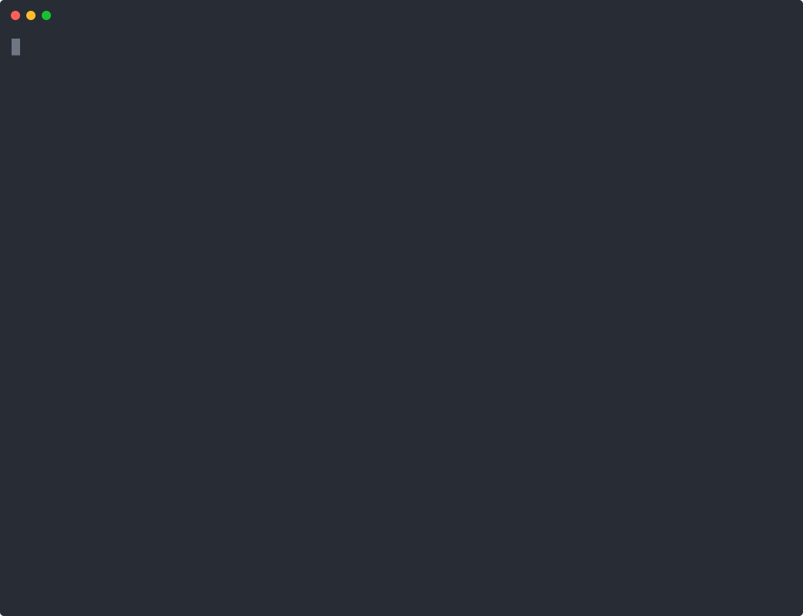

# Introduction

ARES (Agentic Runtime Extensible Server) is an agent server written in Rust. It runs chat agents with multi-provider large language model (LLM) support, tool calling, and retrieval-augmented generation (RAG). It also speaks the Model Context Protocol (MCP) and serves a web UI.

## The Cordis kernel

Every ARES component is a service on a typed `Context`. Services declare dependencies, and the Cordis kernel resolves them at run time. You can add, replace, or intercept services while the server runs.

## What you can do with ARES

You use ARES in three ways:

- **Command line interface (CLI)**: the `ares-server` binary starts the server. It also scaffolds projects, inspects configuration, and drives RAG collections from your terminal. See the [Command Line Interface](cli.md) chapter.
- **HTTP server**: the same binary exposes an HTTP API on Axum. Clients send chat requests over `POST /v1/chat` with an API key. Streaming uses Server-Sent Events (SSE). See the [HTTP API](http-api.md) chapter.
- **Rust library**: the `ares-server` crate is also a library facade. You inject `Execute`, `Tools`, and `Llm` on a Cordis `Context` and run an agent with no HTTP stack. See [ARES as a Library](library.md).

New to ARES? Follow [Installation](getting-started/installation.md), then build your [First Server](getting-started/first-server.md).

## Key capabilities

- Multi-provider LLM routing through one API: OpenAI-compatible endpoints, Azure AI Foundry, AWS Bedrock, and Ollama.
- Tool calling: define tools in configuration. ARES runs the tool-call loop and assembles the response.
- Retrieval-augmented generation: ingest documents into collections and ground responses in them.
- Workflows: chain agents into multi-step flows with entry and fallback agents.
- Multi-tenancy: tenant isolation, scoped API keys, quotas, and usage metering.
- Hot reload: edits to `ares.toml` and TOON files apply without a restart.
- Supervision: the built-in supervisor restarts the server after hot-restart exits.
- MCP integration: bridge external MCP servers as agent-callable tools.

## Where to go next

| Chapter | Purpose |
|---|---|
| [Installation](getting-started/installation.md) | Install or build the `ares-server` binary |
| [First Server](getting-started/first-server.md) | Scaffold, validate, run, and call the server |
| [Command Line Interface](cli.md) | Every subcommand and flag |
