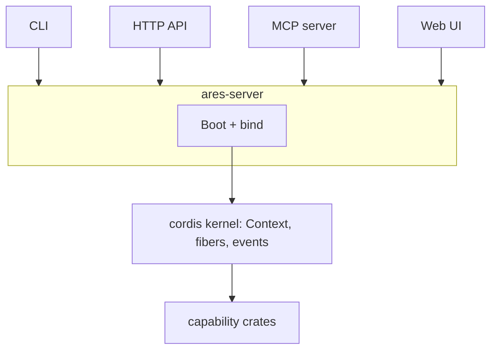

# Introduction

ARES (Agentic Runtime Extensible Server) is an agent server written in Rust. It runs chat agents with multi-provider large language model (LLM) support, tool calling, and retrieval-augmented generation (RAG). It also speaks the Model Context Protocol (MCP) and serves a web UI.

## The Cordis kernel

Every ARES component is a service on a typed `Context`. Services declare dependencies, and the Cordis kernel resolves them at run time. You can add, replace, or intercept services while the server runs.

## How the pieces fit

ARES has four layers. Each layer depends only on the layer below it.

1. **Kernel**. The Cordis kernel (`ares-cordis`) owns one typed `Context` graph, fibers, events, and intercepts. It knows nothing about agents or LLMs.
2. **Capability crates**. Crates under `crates/` register services on that context: storage (`ares-store`), tools (`ares-tools`), providers (`ares-llm`), agents (`ares-agent`), retrieval (`ares-rag`), protocol glue (`ares-mcp`), and HTTP routes (`ares-http`). They talk to each other through services on the context, not through direct wiring.
3. **Server facade**. The `ares-server` package holds the binary and the library facade. It boots the context, registers factories, applies the entries program, and binds the listener.
4. **Surfaces**. The CLI, the HTTP API, the MCP server, and the embedded web UI are entry points into the same running context graph.

The layering gives you two properties. First, you can build a smaller server by dropping capability crates, because nothing above the kernel hard-depends on a capability. Second, you can replace a capability at run time through the loader, because consumers resolve it through the context at call time.

## What you can do with ARES

You use ARES in three ways:

- **Command line interface (CLI)**: the `ares-server` binary starts the server. It also scaffolds projects, inspects configuration, and drives RAG collections from your terminal. See the [Command Line Interface](cli.md) chapter.
- **HTTP server**: the same binary exposes an HTTP API on Axum. Clients send chat requests over `POST /v1/chat` with an API key. Streaming uses Server-Sent Events (SSE). See the [HTTP API](http-api.md) chapter.
- **Rust library**: the `ares-server` crate is also a library facade. You inject `Execute`, `Tools`, and `Llm` on a Cordis `Context` and run an agent with no HTTP stack. See [ARES as a Library](library.md).

New to ARES? Follow [Installation](getting-started/installation.md), then build your [First Server](getting-started/first-server.md).

## Key capabilities

- Multi-provider LLM routing through one API: OpenAI-compatible endpoints, Azure AI Foundry, AWS Bedrock, and Ollama.
- Tool calling: define tools in configuration. ARES runs the tool-call loop and assembles the response.
- Retrieval-augmented generation: ingest documents into collections and ground responses in them.
- Workflows: chain agents into multi-step flows with entry and fallback agents.
- Multi-tenancy: tenant isolation, scoped API keys, quotas, and usage metering.
- Hot reload: edits to `ares.toml` and TOON files apply without a restart.
- Supervision: the built-in supervisor restarts the server after hot-restart exits.
- MCP integration: bridge external MCP servers as agent-callable tools.

## Where to go next

| Chapter | Purpose |
|---|---|
| [Installation](getting-started/installation.md) | Install or build the `ares-server` binary |
| [First Server](getting-started/first-server.md) | Scaffold, validate, run, and call the server |
| [Command Line Interface](cli.md) | Every subcommand and flag |

## Reading paths

Pick the row that matches your goal. Each path lists chapters in reading order.

| I want to... | Read, in order |
|---|---|
| Run a server today | [Installation](getting-started/installation.md), [First Server](getting-started/first-server.md) |
| Call the API from my application | [HTTP API](http-api.md); skim [First Server](getting-started/first-server.md) for tenant and key setup |
| Embed ARES in my own Rust binary | [ARES as a Library](library.md), then [Kernel Patterns in Rust](kernel/patterns.md) |
| Understand what happens at boot | [System Overview](architecture.md), then [Ideas and Map](kernel/index.md) |
| Replace services while the server runs | [Fiber Lifecycle](kernel/lifecycle.md), [Interception Points](kernel/interception.md), [Configuration and Deployment](operations.md) |
| Define agents, tools, or workflows | [Agents and Skills](agents.md); [Command Line Interface](cli.md) for scaffolding commands |
| Ground answers in my documents | [Retrieval](rag.md) |
