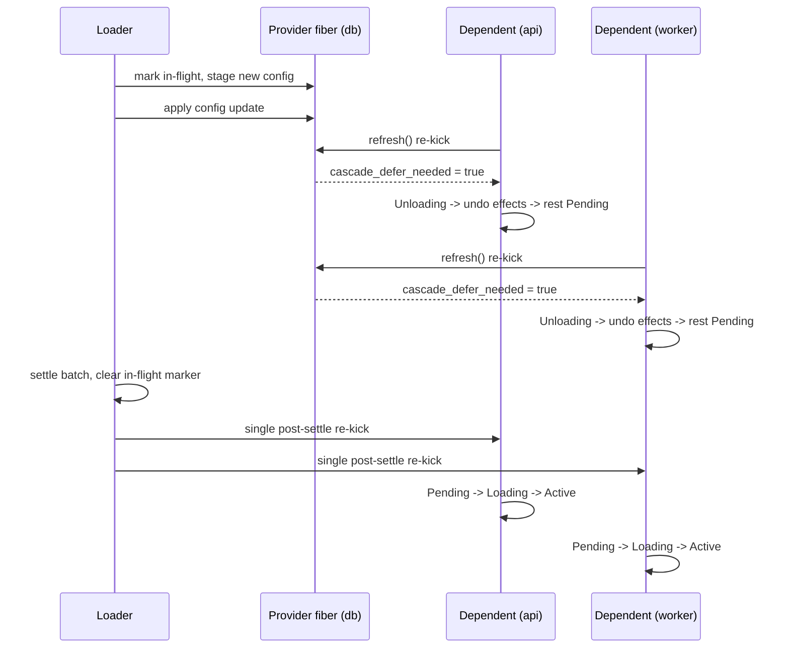

# Fiber lifecycle

A fiber is the lifecycle owner of one registration. Its state machine has seven states. The type is `cordis::fiber::FiberState`.

## States

| State | Meaning |
| --- | --- |
| `Inactive { error }` | Not serving. Pristine, waiting for a first apply, or resting after an unsatisfied declaration. |
| `Loading` | A plugin activation is in flight. |
| `Active { epoch }` | Serving. `epoch` encodes every declared dependency version. |
| `Reloading` | A refresh pass runs. Effects can be undone and re-applied. |
| `Unloading { error }` | Effects are being disposed in reverse order (LIFO). |
| `Pending` | Reactive waiting. Effects were disposed, but the fiber is not disposed. It waits for dependencies or its readiness gate. |
| `Failed { error }` | Terminal after an apply error, or inspectable after an availability-predicate rejection. |

`Pending` carries no error. Reactive waiting is not a failure.

## State diagram

```mermaid
stateDiagram-v2
    [*] --> Inactive
    Inactive --> Loading : dependencies satisfied and gate open
    Loading --> Active : runner returns Ok(true)
    Loading --> Inactive : runner returns Ok(false)
    Loading --> Failed : runner returns Err
    Active --> Reloading : dependency epoch changed
    Active --> Unloading : reactive dependency loss or closed gate
    Reloading --> Unloading : effects undone before re-apply
    Unloading --> Pending : fiber ever activated
    Unloading --> Inactive : dispose completes
    Pending --> Loading : gate opens or provider returns
    Pending --> Pending : still-closed gate (no-op)
    Failed --> Failed : terminal; refreshes refuse to revive
```

Observers see the exact documented sequence across one reactive cycle: `Active`, `Reloading`, `Unloading`, `Pending`, `Loading`, `Active`. Subscribe with `Fiber::subscribe_state`. Test anchor: `observer_sees_unloading_pending_active_sequence`.

## One fiber's life, narrated

Follow one registration through its whole life. Every step names the
region inside `Fiber::refresh` (`crates/cordis/src/fiber.rs`) that owns
it.

**1. Registration.** `RegistryService::register` runs the factory once,
records the raw config on the fiber, and rests it `Inactive` until its
dependencies exist. No undo exists yet.

**2. Dependencies appear.** A provider registers elsewhere. The kernel
re-kicks our fiber. `refresh` acquires the transition lease, then checks
the terminal short-circuit region: no apply error is recorded, so the
pass continues.

**3. Activation.** The pass reaches the runner region. The runner re-runs
and pushes effects — timers, listeners, provided values — onto the undo
accumulator. `Ok(true)` stores the new epoch string and rests the fiber
`Active`. Observers saw `Inactive`, `Loading`, `Active`.

**4. Provider withdrawal.** Another module disposes the dependency's
provider. A refresh computes a new epoch that differs from the stored
one. The genuine-loss guard fires: the provider reads as unavailable with
version 0, the fiber has a reload runner, and it activated at least once.

**5. Unloading.** The reactive-loss region sets `Unloading { error: None }`
and pops every effect in LIFO order. Timers cancel. Listeners detach.
The provided value leaves the store. This is why consumers never observe
a half-torn configuration.

**6. Pending.** Effects are gone but the fiber survives. It rests
`Pending` with no error field. Registry pruning skips it. Strict `get`
refuses its value because none exists; nothing lies about availability.

**7. Return.** The provider re-registers. ReflectService fans the change
out and the fiber re-kicks. The Pending fast-path sees an open path this
time and falls through to one full pass. The runner region executes
again under `Loading`, effects are rebuilt, and a new epoch lands.

**8. Reactivated.** The fiber serves again with fresh effects. Consumers
that waited on strict `get` now resolve it.

Two details matter in production:

- If the plugin factory errored during any pass, region 3 set the terminal
  marker instead. Region 2's short-circuit then returns forever. Recovery
  means explicit re-registration with a fresh fiber id.
- A constraint refusal over a live provider never reaches region 4. The
  provider still reports available, so the fiber rests `Inactive`, not
  `Pending`. See the version rules below.

Test anchors covering this walk: `dependent_reactivates_when_provider_returns`,
`fiber_refresh_passes_through_reloading`, `observer_sees_unloading_pending_active_sequence`.

## Reactive Pending reversal rules

The kernel converts a working configuration into `Pending` only under narrow conditions:

- The fiber lost a dependency **genuinely**: the provider is unavailable and reads provider version 0 again after its undo ran.
- The fiber has a reload runner and completed at least one fully-satisfied application (`ever_activated`). Fibers that never activated rest `Inactive` instead.
- A peer-version constraint refusal over a live provider is policy, not loss. The provider is still available, so those fibers stay `Inactive`.

Apply errors are different. A factory error sets a terminal marker (`apply_failed`). Refreshes never revive such a fiber. Recovery means explicit re-registration with a fresh fiber id. Test anchors: `dependent_reactivates_when_provider_returns`, `failed_stays_failed_on_dep_return`.

Late inject declarations never rest `Pending`. An unsatisfied declaration deactivates the fiber immediately with the note "missing or inactive dependency". The next reactive refresh converts a genuine loss to `Pending`.

A re-kick on a `Pending` fiber with a still-closed gate is a no-op. An open gate falls through to one full pass: `Pending`, `Loading`, `Active`. `RegistryService::prune_disposed` keeps `Pending` fibers alive so they can reactivate. Tests: `pending_fiber_survives_prune_disposed`, `prune_disposed_drops_disposed_but_keeps_failed`.

Every transition acquires the fiber inertia guard through a bounded wait (`TRANSITION_WAIT`, 10 seconds). Same-thread reentrancy fails immediately. Cross-task contention times out with an error naming the stuck fiber id. Tests: `reentrant_transition_detected_fast`, `contention_times_out_named`.

## Peer-version compatibility

A provider can publish a version, and an inject can demand one. The
scheme lives in `Context::VERSION_MAJOR_SCALE`
(`crates/cordis/src/context.rs`). One scale constant splits a plain `u64`
into two fields:

$$S = 100\,000, \qquad \operatorname{major}(v) = \left\lfloor \frac{v}{S} \right\rfloor, \qquad \operatorname{floor}(v) = v - S \cdot \operatorname{major}(v)$$

An inject constrained with requirement \\(r = M \cdot S + f\\) accepts a
provider of version \\(p\\) if and only if:

$$\text{satisfied}(p, r) \iff \bigl(\operatorname{major}(p) = \operatorname{major}(r)\bigr) \;\wedge\; (p \ge r)$$

Read the two clauses as separate guarantees:

- Same major means compatible. Peer dependencies never bind across a
  breaking boundary. A provider at major \\(M+1\\) leaves the dependent
  unsatisfied even when its remainder is huge.
- At or above the floor means feature-complete. Under equal majors,
  \\(p \ge r\\) reduces to \\(\operatorname{floor}(p) \ge f\\). The provider has
  every capability the consumer asked for.

Any mismatch keeps the inject unsatisfied. The dependent fiber rests
`Inactive` rather than silently binding a wrong version. This is the
"constraint refusal over a live provider" rule from the section above.

Legacy `provide` installs version 0. Version 0 satisfies only
unconstrained injects. Migrate providers to `provide_versioned` to opt
into matching. Declare the constraint side with
`Fiber::declare_inject_versioned`.

Worked example: a provider publishes \\(p = 200\,003\\) (major 2, floor 3).

| Requirement \\(r\\) | major match | \\(p \ge r\\) | Verdict |
| --- | --- | --- | --- |
| \\(2 \cdot S + 3 = 200\,003\\) | yes | yes | Satisfied |
| \\(2 \cdot S + 7 = 200\,007\\) | yes | no | Unsatisfied; floor too high |
| \\(1 \cdot S + 1 = 100\,001\\) | no | yes | Unsatisfied; cross-major |
| unconstrained | n/a | n/a | Satisfied |

Source: `VERSION_MAJOR_SCALE` documentation in `context.rs`; constraint
matching in `cordis::fiber`. Test anchor:
`refresh_reruns_provider_after_dependency_version_change` in `registry.rs`.

## Readiness barriers versus availability predicates

The two mechanisms answer different questions.

**Readiness barrier** — "not yet". Install one with `RegistryService::register_with_readiness` and compose predicates with `ReadinessBarrier::new`, `ReadinessBarrier::and`, and `with_readiness`. While the predicate reports false:

- The fiber rests in inspectable `Pending`. This is quiet, reversible waiting.
- The factory still runs once at registration, so config errors surface early.
- Strict `ctx.get` refuses values owned by non-`Active` fibers, so consumers never see the half-ready service.
- Declare watch keys with `ReadinessBarrier::watching`. Any settlement on those types fans out through `ReflectService` and re-kicks the gated fiber.

Test anchors: `ready_when_holds_pending_until_true_then_activates`, `readiness_composes_and_semantics`, `external_rekick_reactivates_waiting_fiber`.

**Availability predicate** — "never, as built". Implement `Service::check`. The registry consults it before the value reaches consumers. A rejection rests the fiber as `Failed { error: "availability predicate rejected service" }`. Registration itself stays non-throwing; later refreshes converge once the instance reports healthy.

Test anchors: `availability_predicate_rejection_registers_failed`, `predicate_passing_reregistration_activates_dependents`.

In short: a closed readiness gate parks the fiber quietly as reversible `Pending`. An availability rejection fails loudly to `Failed{error}`. They are complements, not alternatives.

## Two-phase staged reload

The loader applies a desired entry tree against the current tree in two phases:

1. **Verify without mutating.** Phase one resolves entries and pre-flights config trials against scratch candidates. On the first failed verification, the batch aborts. Nothing changed, so no rollback is needed.
2. **Apply in dependency order.** Phase two applies verified candidates. Begin and rebuild steps run first, then updates, then retire steps. On a failure during phase two, the loader rolls back every applied change newest-first: configs restore, rebuilt fibers dispose. The live tree serves the originals.

On any failure the loader leaves `current` unchanged, so a retry re-diffs cleanly. Config-only patches on active fibers go through the update path with a pre-flight trial, so factory apply counts stay flat.

### Rollback scenarios

The table lists what each phase-two failure undoes. "Applied" means the
step already ran when the failure happened; later steps never start.

| Failure during | Rollback action | Live-tree result |
| --- | --- | --- |
| A config update step | Restore that fiber's prior effective config from the staged candidate | Old config keeps serving |
| A rebuild (dispose + re-apply) step | Dispose the rebuilt fiber's effects in LIFO order | Original fiber's value is gone only if it was retired earlier in the batch — retire steps run after rebuilds |
| A begin step | Nothing to undo; batch stops before any mutation of existing fibers | Tree untouched |
| A retire step | Re-apply is not attempted; earlier applied updates and rebuilds roll back newest-first | Originals serve again |
| Verification (phase one) | No rollback needed; nothing mutated | Identical tree |

Newest-first ordering matters. Suppose a batch updates `A`, then rebuilds
`B` which injects `A`. If `B`'s re-apply fails, rollback disposes `B`'
first and restores `A` second — the reverse of application order.
Consumers of `A` see its original value throughout.

Test anchors: `staged_batch_rolls_back_on_first_failure`, `staged_batch_applies_in_order_on_success`.

## Cascade batching

When a provider fiber sits mid-config-update, dependent refreshes defer instead of churning. `Loader::cascade_defer_needed` probes an in-flight ledger. A deferred dependent rests `Pending` quietly. One post-settle re-kick converges every deferred dependent at once, instead of running one full cascade wave per concurrent patch. Without a `RegistryService` on the context, the probe always reports false and legacy behavior holds.

The timeline below shows two dependents deferring behind one provider
patch and converging together:

Without batching, each concurrent patch triggers one full cascade
wave through every dependent. With three patches landing together, that
is three teardown-rebuild cycles per dependent. Batching collapses them
into one.
