# Fiber lifecycle

A fiber is the lifecycle owner of one registration. Its state machine has seven states. The type is `cordis::fiber::FiberState`.

## States

| State | Meaning |
| --- | --- |
| `Inactive { error }` | Not serving. Pristine, waiting for a first apply, or resting after an unsatisfied declaration. |
| `Loading` | A plugin activation is in flight. |
| `Active { epoch }` | Serving. `epoch` encodes every declared dependency version. |
| `Reloading` | A refresh pass runs. Effects may be undone and re-applied. |
| `Unloading { error }` | Effects are being disposed in reverse order (LIFO). |
| `Pending` | Reactive waiting. Effects were disposed, but the fiber is not disposed. It waits for dependencies or its readiness gate. |
| `Failed { error }` | Terminal after an apply error, or inspectable after an availability-predicate rejection. |

`Pending` carries no error. Reactive waiting is not a failure.

## State diagram

```mermaid
stateDiagram-v2
    [*] --> Inactive
    Inactive --> Loading : dependencies satisfied and gate open
    Loading --> Active : runner returns Ok(true)
    Loading --> Inactive : runner returns Ok(false)
    Loading --> Failed : runner returns Err
    Active --> Reloading : dependency epoch changed
    Active --> Unloading : reactive dependency loss or closed gate
    Reloading --> Unloading : effects undone before re-apply
    Unloading --> Pending : fiber ever activated
    Unloading --> Inactive : dispose completes
    Pending --> Loading : gate opens or provider returns
    Pending --> Pending : still-closed gate (no-op)
    Failed --> Failed : terminal; refreshes refuse to revive
```

Observers see the exact documented sequence across one reactive cycle: `Active`, `Reloading`, `Unloading`, `Pending`, `Loading`, `Active`. Subscribe with `Fiber::subscribe_state`. Test anchor: `observer_sees_unloading_pending_active_sequence`.

## Reactive Pending reversal rules

The kernel converts a working configuration into `Pending` only under narrow conditions:

- The fiber lost a dependency **genuinely**: the provider is unavailable and reads provider version 0 again after its undo ran.
- The fiber has a reload runner and completed at least one fully-satisfied application (`ever_activated`). Fibers that never activated rest `Inactive` instead.
- A peer-version constraint refusal over a live provider is policy, not loss. The provider is still available, so those fibers stay `Inactive`.

Apply errors are different. A factory error sets a terminal marker (`apply_failed`). Refreshes never revive such a fiber. Recovery means explicit re-registration with a fresh fiber id. Test anchors: `dependent_reactivates_when_provider_returns`, `failed_stays_failed_on_dep_return`.

Late inject declarations never rest `Pending`. An unsatisfied declaration deactivates the fiber immediately with the note "missing or inactive dependency". The next reactive refresh converts a genuine loss to `Pending`.

A re-kick on a `Pending` fiber with a still-closed gate is a no-op. An open gate falls through to one full pass: `Pending`, `Loading`, `Active`. `RegistryService::prune_disposed` keeps `Pending` fibers alive so they can reactivate. Tests: `pending_fiber_survives_prune_disposed`, `prune_disposed_drops_disposed_but_keeps_failed`.

Every transition acquires the fiber inertia guard through a bounded wait (`TRANSITION_WAIT`, 10 seconds). Same-thread reentrancy fails immediately. Cross-task contention times out with an error naming the stuck fiber id. Tests: `reentrant_transition_detected_fast`, `contention_times_out_named`.

## Readiness barriers versus availability predicates

The two mechanisms answer different questions.

**Readiness barrier** — "not yet". Install one with `RegistryService::register_with_readiness` and compose predicates with `ReadinessBarrier::new`, `ReadinessBarrier::and`, and `with_readiness`. While the predicate reports false:

- The fiber rests in inspectable `Pending`. This is quiet, reversible waiting.
- The factory still runs once at registration, so config errors surface early.
- Strict `ctx.get` refuses values owned by non-`Active` fibers, so consumers never see the half-ready service.
- Declare watch keys with `ReadinessBarrier::watching`. Any settlement on those types fans out through `ReflectService` and re-kicks the gated fiber.

Test anchors: `ready_when_holds_pending_until_true_then_activates`, `readiness_composes_and_semantics`, `external_rekick_reactivates_waiting_fiber`.

**Availability predicate** — "never, as built". Implement `Service::check`. The registry consults it before the value reaches consumers. A rejection rests the fiber as `Failed { error: "availability predicate rejected service" }`. Registration itself stays non-throwing; later refreshes converge once the instance reports healthy.

Test anchors: `availability_predicate_rejection_registers_failed`, `predicate_passing_reregistration_activates_dependents`.

In short: a closed readiness gate parks the fiber quietly as reversible `Pending`. An availability rejection fails loudly to `Failed{error}`. They are complements, not alternatives.

## Two-phase staged reload

The loader applies a desired entry tree against the current tree in two phases:

1. **Verify without mutating.** Phase one resolves entries and pre-flights config trials against scratch candidates. On the first failed verification, the batch aborts. Nothing changed, so no rollback is needed.
2. **Apply in dependency order.** Phase two applies verified candidates. Begin and rebuild steps run first, then updates, then retire steps. On a failure during phase two, the loader rolls back every applied change newest-first: configs restore, rebuilt fibers dispose. The live tree serves the originals.

On any failure the loader leaves `current` unchanged, so a retry re-diffs cleanly. Config-only patches on active fibers go through the update path with a pre-flight trial, so factory apply counts stay flat.

Test anchors: `staged_batch_rolls_back_on_first_failure`, `staged_batch_applies_in_order_on_success`.

## Cascade batching

When a provider fiber sits mid-config-update, dependent refreshes defer instead of churning. `Loader::cascade_defer_needed` probes an in-flight ledger. A deferred dependent rests `Pending` quietly. One post-settle re-kick converges every deferred dependent at once, instead of running one full cascade wave per concurrent patch. Without a `RegistryService` on the context, the probe always reports false and legacy behavior holds.
