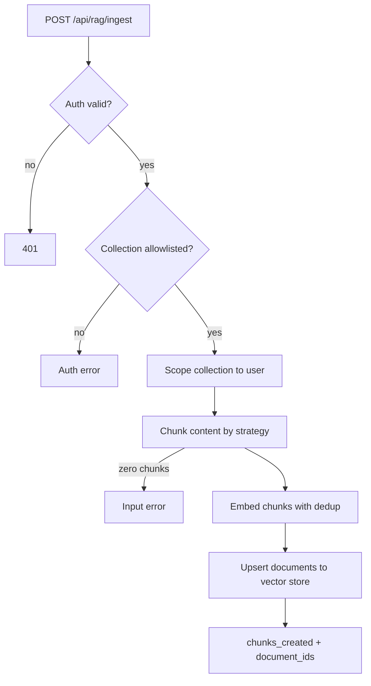

# Retrieval Augmented Generation

ARES ships a RAG (Retrieval Augmented Generation) system: document ingestion, chunking, embeddings, and search. This chapter describes only behavior verified in the source.

## Enabling RAG

The `[rag]` group in `ares.toml` deserializes into `RagConfig` (`crates/ares-rag/src/config.rs`). It has four sub-groups: `vector`, `chunking`, `search`, and `rerank`. Every field defaults, so an empty `[rag]` table is valid.

### Vector group (`[rag.vector]`)

| Field | Default | Meaning |
|---|---|---|
| `enabled` | false | Master switch for the RAG feature. |
| `embedding_model` | `"bge-small-en-v1.5"` | Local embedding model name. |
| `sparse_embeddings` | false | Enable sparse embeddings for hybrid search. |
| `sparse_model` | `"splade-pp-en-v1"` | Sparse model name. |
| `vector_path` | `"./data/vectors"` | Path for vector data on disk. |

The default model emits 384-dimension vectors (`BgeSmallEnV15`, `crates/ares-rag/src/embeddings.rs`). Quantized variants of several models exist under separate names.

### Chunking group (`[rag.chunking]`)

| Field | Default | Meaning |
|---|---|---|
| `chunking_strategy` | `"word"` | One of `"word"`, `"semantic"`, `"character"`. |
| `chunk_size` | 200 | Chunk size; words for word chunking, characters otherwise. |
| `chunk_overlap` | 50 | Overlap between consecutive chunks. |
| `min_chunk_size` | 20 | Smallest chunk size to keep, in characters. |

The chunker (`crates/ares-rag/src/chunker.rs`) exposes `TextChunker` with word, semantic, and character modes. `chunk_with_metadata` returns chunks that carry offsets. Each `Chunk` records `index`, `content`, `start_offset`, and `end_offset`.

Strategy names accept aliases when parsed from strings (`FromStr for ChunkingStrategy`): `words`; `sentence` or `paragraph` for semantic; `char` or `chars` for character. Unknown names fail with an error naming the valid set.

Note one asymmetry. The standalone `ChunkerConfig` struct defaults `chunk_size` to 512. The HTTP ingest handler builds chunkers with its own fixed sizes per strategy (see below).

## Ingestion paths

Two paths reach the same ingest handler:

### Command line

`ares-server rag ingest-dir` walks a local directory and posts each supported UTF-8 text file (.md, .txt, .json, .jsonl) to the server (`src/cli/rag.rs`). Flags:

| Flag | Meaning |
|---|---|
| `--host` | Server base URL. Defaults to `http://localhost:3000`. |
| `--collection` | Collection name to ingest into. Required. |
| `--docs-path` | Directory with documents. Required. |
| `--user` / `--password` | Login credentials. Used when `--token` is absent. |
| `--token` | Bearer token; skips login when present. |
| `--chunking-strategy` | `word`, `semantic`, or `character`. Defaults to `word`. |
| `--tag` | Tag to attach. Repeat for multiple tags. |
| `--dry-run` | List files without sending API requests. |

The command fails closed: a bad path or a failed login stops before any network write. Each document reports its own audit trail, so a partial run leaves no half-ingested files unrecorded.

The following outputs come from running this binary against a real directory (`exercised`, ARES v0.10 tree):

```console
$ ares-server rag ingest-dir --collection demo --docs-path /tmp/ragdemo --dry-run
/tmp/ragdemo/alpha.md	alpha	21 bytes
/tmp/ragdemo/beta.txt	beta	12 bytes
dry_run=true documents=2

$ ares-server rag ingest-dir --collection demo --docs-path /tmp/no-such-dir
Error: "docs path is not a directory: /tmp/no-such-dir"
```

The dry-run prints one `path<TAB>title<TAB>size` line per candidate file and a summary line. The bad path aborts with an error before any login or HTTP call.

### HTTP

`POST /api/rag/ingest` accepts a JSON body with `collection`, `content`, `title`, `source`, `tags`, and `chunking_strategy`; it returns `chunks_created` plus `document_ids` and echoes the unscoped collection name (`crates/ares-http/src/api/handlers/rag.rs`, `src/cli/rag.rs`). The endpoint requires authentication and checks tenant-level RAG source allowlists before ingesting. Routes register only when both the `local-embeddings` and `ares-vector` features compile in (`crates/ares-http/src/api/routes.rs`).

Related endpoints: `POST /api/rag/search`, collection listing under `/api/rag/collections`, and `DELETE /api/rag/collection`.

### Ingest handler stages

The handler (`crates/ares-http/src/api/handlers/rag.rs`, `ingest`) runs these stages in order:

1. **Validate input.** An empty `collection` or empty `content` returns an error before any work starts.
2. **Check the tenant allowlist.** `TenantAllowlistStore::is_rag_source_allowed` consults PostgreSQL. A denied collection fails with an auth error naming the collection.
3. **Scope the collection name.** `user_scoped_collection` combines the user id and requested name, giving each user an isolated namespace.
4. **Resolve services.** The embedding service comes from the context, or gets constructed on first use. Construction pre-downloads ONNX model files through lancor, because fastembed's own client fails on HuggingFace CDN redirects. The vector store opens at `[rag.vector] vector_path`.
5. **Parse the chunking strategy.** Absent keys fall back to `Word`. The handler then fixes chunker parameters per strategy: word uses size 200 with overlap 50, semantic uses size 500 with no overlap, character uses size 500 with overlap 100.
6. **Chunk the content.** Zero chunks fail with `Content too small to chunk`. Short trailing remainders below `min_chunk_size` drop out silently instead.
7. **Create the collection on demand.** If the scoped collection does not exist, the handler creates it with the model's dimension count.
8. **Embed all chunk texts.** The batch passes through the dedup planner described below.
9. **Build documents.** Each chunk becomes a `Document` with id `{base_uuid}_{index}` and metadata carrying `title`, `source`, `created_at`, and `tags`.
10. **Upsert into the vector store** and return `chunks_created` with the document id list. A structured log records user, collections, chunk count, and duration.



## Chunking algorithms

Each mode behaves differently (`crates/ares-rag/src/chunker.rs`):

- **Word.** Split text on whitespace. Walk forward by `step = chunk_size - chunk_overlap`, never less than 1. Join each window back with single spaces. Character offsets are approximated by summing word lengths plus one separator per earlier word, so offsets drift when original spacing differed.
- **Semantic.** Hand the text to `TextSplitter::new(chunk_size)` from the `text-splitter` crate. It splits on sentence and paragraph boundaries up to the size cap. Overlap does not apply in this mode. Offsets come from searching each produced slice in the remaining text.
- **Character.** Collect chars and walk by the same step formula as word mode. Offsets are exact char positions.

All three modes drop candidates shorter than `min_chunk_size`.

## Embeddings and deduplication

Embeddings live in `crates/ares-rag/src/embeddings.rs`. Two facts matter:

- Dedup per request: identical inputs collapse by a whitespace-normalized SHA-256 content hash (`normalize_for_dedup` plus `content_hash_hex`) before the backend call. Computed vectors fan back to every duplicate slot, so callers receive full-length results while identical texts cost one backend call.
- Vectors are L2-normalized to unit length after computation (`normalize_embedding`).

### Dedup walkthrough

Three functions cooperate:

1. `normalize_for_dedup("  hello   world \n\t again ")` returns `"hello world again"`. Trimming and collapsing whitespace makes spacing differences invisible to the hash.
2. `content_hash_hex` hashes the normalized text with SHA-256 and formats lowercase hex.
3. `DedupPlan::plan(texts)` walks inputs once. First occurrences record their index in `unique_indices`; every duplicate records which unique slot it maps to in `sources`.

After the backend embeds only the unique texts, `fan_out(&vectors)` rebuilds the full-length list where `result[i] == vectors[sources[i]]`. The seen-set lives only for the duration of one call, so memory stays bounded. Both the local fastembed path and the HTTP batched path use the same plan (`embed_texts`, `embed_texts_batched`).

Worked example, given inputs `["alpha", " alpha\n", "beta"]`:

- Hashes: slot 0 covers `alpha`; the second entry normalizes to `alpha` too, so it maps to slot 0; `beta` takes slot 1.
- Backend call receives `["alpha", "beta"]` — two texts, not three.
- Fan-out returns `[v0, v0, v1]`.

Model initialization serializes through global per-model locks, so parallel first-use requests cannot race a model download.

## Similarity math

Two dense vectors compare through cosine similarity (`cosine_similarity`, `crates/ares-rag/src/embeddings.rs`):

$$\cos(\mathbf{a},\mathbf{b}) \;=\; \frac{\sum_i a_i b_i}{\sqrt{\sum_i a_i^2}\,\sqrt{\sum_i b_i^2}}$$

Mismatched lengths or a zero magnitude return `0.0`, and the result clamps into \\([-1, 1]\\). When both vectors have unit length — which `normalize_embedding` produces — the denominator equals 1 and the whole expression reduces to the dot product:

$$\|\mathbf{a}\| = \|\mathbf{b}\| = 1 \quad\Longrightarrow\quad \cos(\mathbf{a},\mathbf{b}) = \sum_i a_i b_i$$

Cosine distance stored by pgvector-style comparisons is `1 - cos(a,b)` (`cosine_distance`). At query time, raw distances convert back to similarity scores where higher means better (`distance_to_similarity`, `crates/ares-rag/src/search.rs`):

$$\text{sim}_{\text{cosine}} = 1 - d \qquad \text{sim}_{L2} = \frac{1}{1+d} \qquad \text{sim}_{\text{inner}} = -d$$

The `local-embeddings` feature enables the `fastembed` backend (`crates/ares-rag/Cargo.toml`). Without it, embedding calls go over HTTP.

## Search flow

`SearchStrategy` (`crates/ares-rag/src/search.rs`) supports four strategies, also accepted by the CLI as `--strategy`:

| Strategy | Aliases | Matches on | Index used | Persisted |
|---|---|---|---|---|
| `semantic` | `dense`, `vector` | Meaning, via dense embeddings | Vector store collection | Yes (vector data) |
| `bm25` | `lexical`, `sparse` | Exact terms, TF-IDF weighted | Inverted index | Yes (`bm25_index.json`) |
| `fuzzy` | `approximate` | Typos, via edit distance | Vocabulary plus document map | Yes (`fuzzy_index.json`) |
| `hybrid` | `combined`, `rrf` | Union of all three | All indices | Via component indices |

Unknown names fail with an error naming the four valid sets.

### Semantic scoring

The engine validates query embeddings first: non-empty, all finite, and dimension-matched when a dimension is known (`validate_embedding`). SQL orders by the metric operator and computes the score expression inline; collection names must pass validation before they can reach a table name (`{prefix}_{collection}`).

Result post-processing follows one shared path (`rank_results`): drop scores under the threshold, keep the highest-scoring copy of duplicate ids, sort descending, truncate to `top_k`.

### BM25 scoring

`Bm25Index` keeps an inverted index and document frequencies. Tokenization lowercases, splits on non-alphanumeric characters, and drops tokens of length 1 or less. Term rarity enters through IDF (`Bm25Index::idf`):

$$\mathrm{idf}(t) \;=\; \ln\!\left(\frac{N - df_t + 0.5}{df_t + 0.5} \;+\; 1\right)$$

Defaults follow standard BM25 saturation and length normalization: \\(k_1 = 1.2\\), \\(b = 0.75\\) (`Bm25Index::new`). Search collects candidate documents containing any query term, scores them, sorts descending, and truncates.

### Fuzzy matching

`FuzzyIndex` stores a vocabulary of indexed words. Query correction finds the closest vocabulary word within `max_distance` edits (default 2, Levenshtein). Exact hits short-circuit at distance 0. `correct_query` rewrites each misspelled word and reports every correction as an `original`/`corrected`/`distance` triple. Match score per document is one minus normalized distance, averaged over matched query words.

### Hybrid fusion

Hybrid search fuses three ranked lists through reciprocal rank fusion (`RrfFusion::fuse`). Raw scores are ignored; only positions count. With lists \\(\ell\\) and weights \\(w_\ell\\), a document's fused score is:

$$\mathrm{score}(d) \;=\; \sum_{\ell} \frac{w_\ell}{k + \mathrm{rank}_\ell(d)} \qquad k = 60 \text{ by default}$$

Ranks start at 1 in this implementation (`search.rs`, `RrfFusion::fuse`). Default weights are `semantic = 0.6`, `bm25 = 0.3`, `fuzzy = 0.1` (`HybridWeights::default`); the sum should be 1.0. Hybrid fetches `top_k * 2` candidates from BM25 and fuzzy before fusion, then truncates the fused list to `top_k`. A typo-corrected variant corrects the query first, then reruns the whole fusion.

Worked fusion, with unit weights and \\(k = 60\\) (adapted from the passing test `test_rrf_fusion_ranking_prefers_shared_top_ranks`). The semantic list ranks `doc_a` first and `doc_b` second. The BM25 list ranks `doc_b` first and `doc_c` second:

$$\mathrm{score}(\text{doc\_a}) = \tfrac{1}{61} = 0.0164$$
$$\mathrm{score}(\text{doc\_b}) = \tfrac{1}{62} + \tfrac{1}{61} = 0.0325$$
$$\mathrm{score}(\text{doc\_c}) = \tfrac{1}{62} = 0.0161$$

The document appearing in both lists wins even though it never held rank one anywhere.

The BM25 and fuzzy indices support `save()` and `load()`, so they survive restarts without re-indexing. `SearchEngine::save` writes `bm25_index.json` and `fuzzy_index.json` into one directory; `load_or_new` falls back to fresh empty indices when the directory is missing. `ares-server rag search --collection <name> --query <text> [--top-k N] [--strategy S]` drives the flow from the terminal.

## Vector stores

Two backends exist behind features:

- `ares-vector` (`crates/ares-vector/`) — a pure-Rust embedded store built on an HNSW index. Two construction modes differ only in persistence (`Config`, `crates/ares-vector/src/config.rs`):

  | Mode | Constructor | Behavior |
  |---|---|---|
  | Memory | `Config::memory()` | No `data_path`; data dies with the process. |
  | Persistent | `Config::persistent(path)` | Sets `data_path` and turns on periodic snapshotting; collections reload on startup. |

  Tuning knobs include `max_vectors` per collection and the `HnswConfig` fields (`m`, `m_max`, `ef_construction`, `ef_search`, thread counts). A `memory_efficient()` preset trades accuracy for footprint (`m = 8`, single-threaded construction). Collections are typed by dimension and distance metric at creation; searches reject wrong-dimension queries with `DimensionMismatch`. This backend backs the default `[rag.vector]` path.

- Qdrant — optional external store configured through `database.qdrant` in `ares.toml` (`QdrantConfig` in `crates/ares-store/src/config.rs`). Fields: `url` (default `http://localhost:6334`) and `api_key_env`, the environment variable holding the API key. ARES treats it as an external service and holds no local state for it.
